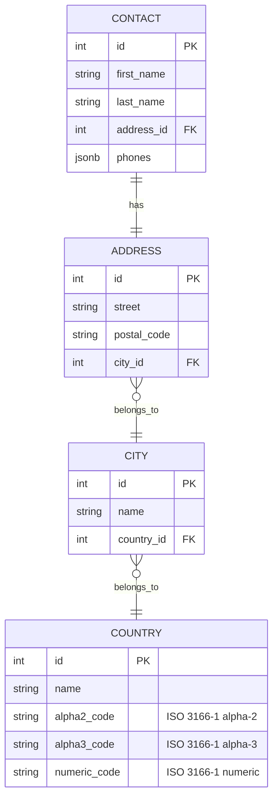

# Phone Book API

A simple RESTful API for managing a phone book, built with Golang using Clean Architecture and TDD.

## Project Structure
- `cmd/api/` - Application entry point (`main.go`).
- `internal/domain/` - Core domain layer containing business logic and entities.
  - `entities/` - Aggregate roots and value objects (e.g., `Contact`, `Phone`, `Address`).
  - `repositories/` - Interfaces for data access (e.g., `contact_repository.go`).
  - `errors.go` - Domain-specific error types and factory methods.
- `internal/application/` - Use cases orchestrating domain logic.
  - `commands/` - CQRS command definitions (e.g., `add_contact_command.go`).
  - `handlers/` - Handlers for commands (e.g., `add_contact_handler.go`).
  - `queries/` - CQRS query definitions (e.g., `search_contact_query.go`).
- `internal/infrastructure/` - External systems (e.g., database, logging).
  - `persistence/` - Database implementations (e.g., `postgres_contact_repository.go`).
- `internal/delivery/` - API handlers and request structs.
  - `http/` - HTTP endpoints (e.g., `add_contact_request.go`).
- `tests/` - Test files (e.g., `add_contact_test.go`, `phone_test.go`).

## Architecture
- **Clean Architecture**: Separates domain logic from infrastructure and delivery, ensuring a focus on business rules.
- **CQRS Pattern**: Implements Command Query Responsibility Segregation to separate write (commands) and read (queries) operations, enhancing scalability and flexibility.

### ERD Diagram


### Architecture Notes

- **UUID for Entity IDs**: The entities uses `uuid.UUID` (from `github.com/google/uuid`) as its `ID` field. This decision supports cloud-native scalability by ensuring globally unique identifiers without reliance on a centralized database sequence. UUIDs are particularly beneficial for future sharding, distributed systems, or multi-region deployments with PostgreSQL, which natively supports the `UUID` type. While this increases storage (16 bytes vs. 4-8 bytes for integers), it eliminates ID collision risks and simplifies integration in a distributed architecture.

- **Phone Numbers as JSONB**: Phone numbers are stored as a JSONB array within the Contact entity. This decision avoids expensive join operations and transactions, improving write performance. Since phone numbers are frequently updated along with contact information, this denormalization reduces the complexity and cost of maintaining separate tables for phone numbers.
- **Normalized Cities and Countries**: Cities and countries are normalized into separate tables because they are primarily used for read operations. This normalization ensures data consistency and reduces redundancy, as cities and countries are rarely updated.

### Domain-Driven Design (DDD) Decisions
- **Contact as Aggregate Root**: The `Contact` entity is defined as an aggregate root, encapsulating `Phone` and `Address` as value objects. All commands and queries interact with `Contact` as the entry point, ensuring consistency within its boundary. This aligns with DDD by centralizing business rules (e.g., validation of `Phone` in E.164 format) within the aggregate.
- **Nested Command Model**: Commands like `AddContactCommand` use a nested structure (e.g., `Phone` and `Address` as value objects) rather than a flat list of fields. This mirrors the `Contact` aggregate’s structure, reducing validation duplication and reinforcing domain cohesion. For example:
  ```go
  type AddContactCommand struct {
      FirstName string          `validate:"required"`
      LastName  string          `validate:"required"`
      Phone     entities.Phone  `validate:"required"`
      Address   entities.Address `validate:"required"`
  }

## Setup Instructions
1. Ensure Docker and Docker Compose are installed.
2. Build and run the app:
   ```bash
   docker-compose up --build
   ```
3. Access the Swagger UI at http://localhost:8080/swagger/.
4. Access Jaeger UI at http://localhost:16686.
5. Access Prometheus UI at http://localhost:9090.
6. Access Grafana UI at http://localhost:3000.

## API Testing with `api_test.http`

The `api_test.http` file contains a set of HTTP requests for testing the API endpoints. You can use tools like VS Code REST Client or Postman to run these tests.
